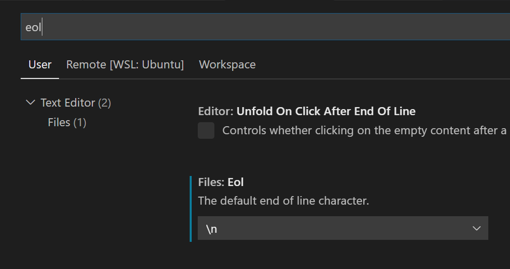
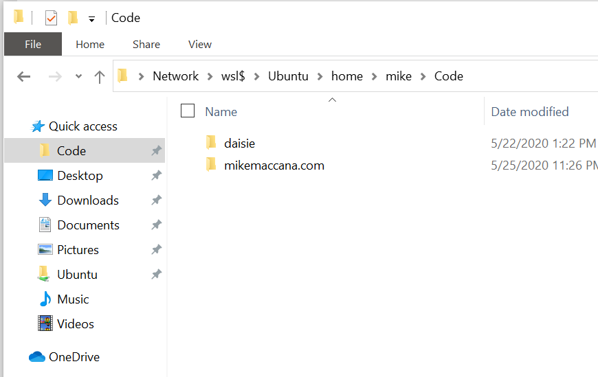
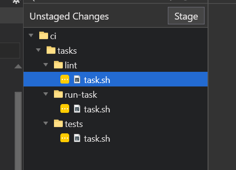

# How to install a Linux development environment on Windows

## Using Ubuntu and WSL2

<!-- START doctoc generated TOC please keep comment here to allow auto update -->
<!-- DON'T EDIT THIS SECTION, INSTEAD RE-RUN doctoc TO UPDATE -->

- [Why this guide](#why-this-guide)
- [Why WSL2?](#why-wsl2)
- [Why not WSL2?](#why-not-wsl2)
- [Why this guide](#why-this-guide-1)
- [Right now it's a great time to try WSL](#right-now-its-a-great-time-to-try-wsl)
- [What goes where](#what-goes-where)
- [Enable WSL2](#enable-wsl2)
- [If you need to: enable Virtualisation in UEFI/BIOS](#if-you-need-to-enable-virtualisation-in-uefibios)
- [Set WSL to WSL2](#set-wsl-to-wsl2)
- [Get apps via Winget](#get-apps-via-winget)
- [Configure Terminal for Unix settings](#configure-terminal-for-unix-settings)
- [Make git use Windows Credential Manager](#make-git-use-windows-credential-manager)
- [Set up Windows for development in WSL2](#set-up-windows-for-development-in-wsl2)
  - [Add Ubuntu to Windows Explorer](#add-ubuntu-to-windows-explorer)
  - [Use a tiling window manager](#use-a-tiling-window-manager)
- [Set up Ubuntu for development in WSL2](#set-up-ubuntu-for-development-in-wsl2)
  - [Install Linux developer Tools](#install-linux-developer-tools)
  - [Quiet Ubuntu's login](#quiet-ubuntus-login)
  - [Use sudo without a password](#use-sudo-without-a-password)
  - [Make tab completion work with any case](#make-tab-completion-work-with-any-case)
  - [Add other development tools](#add-other-development-tools)
  - [Make VScode open files using file:linenumber syntax](#make-vscode-open-files-using-filelinenumber-syntax)
  - [Add an `open` command to open files with Windows apps](#add-an-open-command-to-open-files-with-windows-apps)
  - [Add ~/bin to your PATH](#add-bin-to-your-path)
  - [Add any databases or other Linux services](#add-any-databases-or-other-linux-services)
  - [Configure git to ignore file mode changes](#configure-git-to-ignore-file-mode-changes)
- [Conclusion](#conclusion)
- [About the author](#about-the-author)

<!-- END doctoc generated TOC please keep comment here to allow auto update -->

## Why this guide

This a guide for people familiar with Linux and Unix environment, to create a development environment on Windows using WSL2 and Ubuntu.

I don't work for Microsoft or Canonical - I [develop web apps and before that was a Linux admin](https://mikemaccana.com). For most of this time, my main machines have been either Linux or macOS. This means:

- My fingers know bash's defaults. I type `/` to separate directories, `ctrl R` to search history, and edit lines with `ctrl ◀` and `ctrl ▶` without thinking. I know `grep`, `sed` `awk` and the usual ways of scraping and manipulating text on the console.
- I select things in a terminal to automatically copy them and I click a mouse button to paste.
- The idea that anybody would want a file in anything other than 'LF' line endings is alien to me.

In short, my developer profile is very Linux and Unix oriented. Much like you, I don't want to throw away that knowledge and muscle memory to use something different.

## Why WSL2?

- It's **familiar**. Working with WSL2 isn't that much different than changing Linux distributions, or moving between Linux and macOS.
- Windows has **excellent hardware support**. Whether you get high-end Surface hardware, or build your own rig from components, you'll get full featured Windows drivers from the hardware manufacturer.

- `apt-get` has **more packages** than `brew` on macOS.

- **Design tools common in web development** are usually available for Windows.

- There are some **useful Windows-based developer GUI tools**. While I'm comfortable using `git rebase -i` (so don't @ me), the visual interactive rebase in [Fork](https://git-fork.com/), a Windows git app, is a great way to clean up my commit history before pushing.

Finally: **Windows is nice**. The inbuilt tools are modern and uncluttered, my desktop unlocks when I sit down due to Windows Hello, I can transfer files back and forth between my desktop and my phone easily.

## Why not WSL2?

- Like setting up any new OS, there's work to do to make it your own.

- Some things _will_ be different if you're used to another OS.

- While storing your code on Linux makes things nice and fast, accessing files on Linux from Windows tools is still not as fast as accessing Windows files from Windows tools. In practice (as a node developer working on large TypeScript project) I find the current speed to not be an issue in my day to day work.

## Why this guide

The aims for this guide as follows:

- To be as complete as possible, have this guide be the go-to place for people used to developing on a Unix environment.

- To include developer focused settings of interest to Linux/Unix developers that make working on WSL2 easier, like `.bashrc`, `.inputrc` and `git` settings.

- To save time when setting up a new development environment. Eg, setting WSL to version 2 before installing Ubuntu (so Ubuntu is already WSL version 2), and installing Ubuntu before Docker (so Docker and VScode detect Ubuntu and add their commands.)

- Best practices, like keeping your code on the Linux side to make them faster.

## Right now it's a great time to try WSL

There's a new Ubuntu release (20.04) and a new Windows release (20.04), both with a bunch of new features.

## What goes where

- Your code will be in the Linux filesystem, for speed.
- Your language support (node, Python, Ruby, Rust. Go, Elixir etc) will in Linux.
- Databases (I like Postgres) and Docker containers will be in Linux
- IDEs will be in Windows (vscode installs a special WSL helper into Linux though)
- Browsers will be in Windows (yes, WSL makes localhost work exactly like normal)

## Enable WSL2

Click Start Type "Powershell". Click "Run as Administrator"

Run these two commands to enable WSL:

    dism.exe /online /enable-feature /featurename:Microsoft-Windows-Subsystem-Linux /all /norestart

    dism.exe /online /enable-feature /featurename:VirtualMachinePlatform /all /norestart

## Reboot (and enable Virtualisation in UEFI/BIOS if you need to)

Surface devices have virtualisation turned on already,so you can just reboot.

Otherwise, you may have to go into your UEFI/BIOS and enable Virtualisation. You can reboot to your UEFI/BIOS from inside Windows. Open the Settings app, search for "Recovery Options", and "Restart Now".

When your PC reboots, it will go into Advanced startup. Go to “Troubleshoot -> Advanced options" and click on the "UEFI Firmware Settings" option.

## Set WSL to WSL2

Currently, the older WSL1 is still the default. The new WSL2 (which uses a real Linux kernel):

    wsl --set-default-version 2

Open Ubuntu from the start menu and and let it install.

Have a message about Virtualisation needing to be enabled? See the next step.

This ensures distros you install subsequently will run on WSL 2.

If you've already installed Ubuntu, just convert our existing WSl1 Ubuntu to WSL2 run:

    wsl -l -v
    wsl --set-version Ubuntu 2
    wsl --set-default-version 2

## Get apps via Winget

Get [App Installer](https://www.microsoft.com/p/app-installer/9nblggh4nns1?ocid=9nblggh4nns1_ORSEARCH_Bing&rtc=1&activetab=pivot:overviewtab) (which includes the `winget` command) if you don't have it already.

Let's install:

- DockerDesktop (the Windows apps adds `docker-compose` and other useful things to Linux)
- Git (needed for Windows GUI tools)
- Power Toys (for tiling window management)
- Powershell (the latest one is faster)
- Visual Studio Code
- Windows Terminal

Note: 'Ubuntu 20.04' isn't available by Winget, but will be soon.

    foreach ($app in 'DockerDesktop', 'Git', 'Power Toys', 'Powershell', 'Visual Studio Code', 'Windows Terminal') {  winget install -e  $app }

## Configure Terminal for Unix settings

Open terminal settings and change:

    "copyOnSelect": true,

Then look at the profiles. Find the `Ubuntu` profile. See the Ubuntu profile has a GUID? Change the default profile GUID to the Ubuntu GUID.

Also, because transparent terminals are cool, add this to the Ubuntu profile:

    "useAcrylic": true,
    "acrylicOpacity": 0.9

Browse [iterm2colorschemes.com](https://iterm2colorschemes.com/) and download the equivalent named Windows Terminal file from [their Windows Terminal color schemes](https://github.com/mbadolato/iTerm2-Color-Schemes/tree/master/windowsterminal). Open **Settings** and paste it into the `schemes` section, then select that scheme name for the profile you want to use it with in `profiles`.

## Make git use Windows Credential Manager

`edit ~/bin/git-credential-manager`

And make the file's contents be:

    #!/bin/bash
    exec '/mnt/c/Program Files/Git/mingw64/libexec/git-core/git-credential-manager.exe'

Set the modes:

`chmod +x ~/bin/git-credential-manager`

Then `edit ~/.gitconfig` and add

    [credential]
        helper = manager

## Set up Windows for development in WSL2

### Ensure Windows git always uses LF line endings (Unix-style)

```
git config --global core.autocrlf false
git config --global core.eol lf
```

### Ensure VScode always uses LF line endings (Unix-style)

In vscode, open 'Preferences', and search for 'eol'. Set `The default end of line character.` to `/n`



### Add Ubuntu to Windows Explorer

Pin `\\wsl$\Ubuntu` to Quick Access



### Use a tiling window manager

If you're the tiling window manager, check out [FancyZones](https://github.com/microsoft/PowerToys/tree/master/src/modules/fancyzones). It's part of [PowerToys](https://github.com/microsoft/PowerToys).

## Set up Ubuntu for development in WSL2

Open Ubuntu from Windows Terminal and set up your development environment:

### Make VScode the default editor, and open files using file:linenumber syntax

I usually like to refer to my current editor as `edit`. `code -g` allows vscode to open a `filename:linenumber` and immediately to go that line number in a file. VSCode doesn't do this by default, because some files can have a colon in them. I don't put colons in file names, so I add this to my `.bashrc`

    export EDITOR=code
    alias edit='code -g'

### Install Linux developer Tools

    sudo apt install build-essential

### Quiet Ubuntu's login

    touch /home/mike/.hushlogin

### Use sudo without a password

Typing your own password can get boring.

    sudo visudo

And edit the line below to as follows:

    # Allow members of group sudo to execute any command
    # %sudo ALL=(ALL:ALL) ALL
    %sudo ALL=(ALL) NOPASSWD:ALL

After you save the file, `sudo` will no longer ask for passwords.

### Make tab completion work with any case

Open .inputrc (create it if needed) and add:

    set completion-ignore-case On
    $include /etc/inputrc

### Add other development tools

Your command line developer tools are generally Linux ones, and will live in the WSL2 filesystem.

I code primarily on node.js, so I'd install

    curl -sL https://deb.nodesource.com/setup_10.x | sudo -E bash -
    sudo apt-get install -y nodejs

### Add an `open` command to open files with Windows apps

WSL2 comes with a Debian package called `wslu` which contains a command to open files using Windows, called `wslview`. Personally, I prefer the name `open` so:

    alias open='wslview'

### Add ~/bin to your PATH

I like to add personal scripts and files to `~/bin`

    export PATH=\$PATH:~/bin

### Add any databases or other Linux services

WSL2's Ubuntu uses a custom `/init`, which uses `/etc/init.d` style scripts.

You can start, stop, check the status of these with:

`sudo /etc/init.d/postgresql start`

or

`sudo service postgresql start`

Replacing `start` with `stop` or `status` etc.

### Configure git projects to ignore file mode changes

Checking out a repo on your Linux box, Windows git tools may report some files seem to have changed, with no actual modification of their contents:



What has changed is their Unix file modes (the `mod` in `chmod`) - let's disable this. Inside a project:

    git config core.fileMode false


## Conclusion

## About the author

I've been using Linux for a little over 20 years, including at places like Red Hat and IBM's dedicated Linux group. I'm the example `sudo` user in `/etc/sudoers` in a couple of distros.
